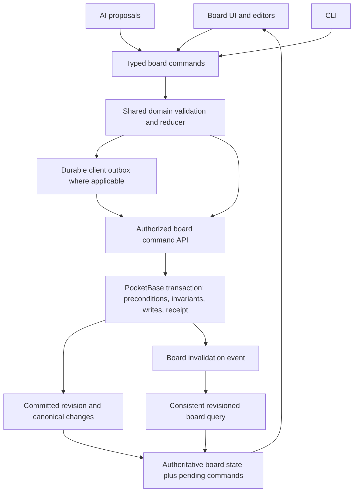

# Kanban architecture review — 2026-09-19

## Verdict and scope

The current kanban architecture does not yet meet a high reliability bar. Its transactional write path is a useful foundation, but the same board has multiple independently implemented representations, and identity, intent, and acknowledgement are lost between layers. Those gaps can cause false conflicts, invisible cards, and silent data loss.

The earlier shared-fingerprint patch addresses one mismatch. It is not a complete fix: real database tests in this review still reproduced different fingerprints for the same unchanged board, and exposed linked-card loss through AI proposals.

Reviewed the working tree based on commit `cea4751`, including the uncommitted fingerprint patch. Other work was modifying UI, proposal application, and tests concurrently. Findings below identify the functions inspected; line numbers may shift. This review made no application-source changes and did not access production. It added this report and a disposable diagnostic test file under `.tmp`.

## Confirmed findings, in priority order

### 1. P1 — AI serialization can erase links without advertising any changes

`normalizeTask` in [AI sync](E:/avarnic/kainbu/server/workspace-ai/sync.ts:167) reconstructs tasks without `linkedTaskIds`. Both the original board used for the review diff and the proposed board pass through this parser. Consequently the link loss disappears from the computed operations, while the saved preview still loses the links. [Persistence](E:/avarnic/kainbu/src/lib/kainbu/boardSyncCore.ts:107) correctly interprets that missing field as an empty link list.

**Reproduced against disposable PocketBase:** create two linked cards, materialize the board, make no AI edits, collect proposals. The collector emits a board proposal with `ops: []`. Saving its preview clears the stored links.

This also demonstrates a fundamental contract failure: the operations reviewed by the user are not the operations persisted. A shared fingerprint cannot prevent it.

**Required change:** one lossless board codec; runtime validation at boundaries; one typed operation representation from which preview, safety summary, persistence mutations, and undo are derived. Enforce `apply(base, operations) == preview` over all persisted semantic fields, and reject an empty operation list with a different preview.

### 2. P1 — An unchanged board still compares stale because read adapters disagree

The [normal workspace mapper](E:/avarnic/kainbu/src/lib/kainbu/pbRecords.ts:152) converts unset due dates to no date. The [AI mapper](E:/avarnic/kainbu/server/workspace-ai/sync.ts:430) preserves numeric zero. The shared fingerprint then compares `null` to `0`.

**Reproduced against disposable PocketBase:** create a normal card without a due date, load it through the actual workspace loader and AI materializer, and compare fingerprints. They differ without any edit.

PocketBase documents numeric fields as non-nullable with zero defaults; this is normal stored data, not an unusual malformed record. See [PocketBase field defaults](https://pocketbase.io/docs/collections/).

Additional static evidence of adapter drift: [workspace loading](E:/avarnic/kainbu/src/lib/kainbu/loadWorkspaceFromRemote.ts:52) defaults a zero-width column to 240, while [AI loading](E:/avarnic/kainbu/server/workspace-ai/sync.ts:334) defaults it to 268. The workspace loader also breaks position ties by creation time and ID, while the AI loader sorts only by position. Those additional cases were inspected but not database-reproduced in this review.

**Required change:** share record-to-domain mapping, defaults, ordering, and canonicalization. Treat fingerprints as derived diagnostics, version their contract, and avoid using independently assembled JSON strings as the concurrency authority. Previously stored proposals need an explicit legacy-format policy.

### 3. P1 — A successful sync can create an invisible orphan card

The [transactional hook](E:/avarnic/kainbu/pocketbase/pb_hooks/workspace.js:98) validates project and board ownership but does not validate that an upserted task's `column_id` identifies an existing column in that board. The schema stores this as text, not a relation.

**Reproduced against disposable PocketBase:** client A reads an empty column; client B deletes it; A adds a card using its old snapshot. The diff has a task addition but no column change. The hook returns success and stores the task pointing to the deleted column. The normal workspace loader returns an empty board because there is no column in which to render it.

**Required change:** check structural invariants inside the same transaction after interpreting the complete command batch. Every live task must have one existing parent column in its board. A deleted destination should return a structured conflict and preserve the user's draft. Validate link endpoints and assignment eligibility there as well. Restrict raw collection mutations, or enforce equivalent invariants on every permitted write path.

### 4. P1 — General board Undo can erase collaborators' later work

[Board Undo](E:/avarnic/kainbu/src/lib/components/WorkspaceShell.svelte:3755) replaces the current board with an older whole-board history entry. [Mutation derivation](E:/avarnic/kainbu/src/lib/kainbu/boardSyncCore.ts:127) then treats differences against the latest board as intentional changes.

**Reproduced with the actual mutation helpers:** after a local title edit, a collaborator changes a description and adds a card. Undo clears that description and marks the new card deleted. Its `previous` values contain the collaborator's latest work, so the database conflict guard has no way to know those changes were unintended.

This concerns the general board Undo/Redo path. A separate applied-AI-change undo guard was being added concurrently and does not establish correctness of general history.

**Required change:** record inverse operations for each local action, with preconditions on only the fields/entities the original action changed. Undo a title edit by restoring that title, leaving new cards and unrelated descriptions intact. Report a conflict if the title itself changed subsequently.

### 5. P1 — Proposal board identity is reconstructed from navigation

The persisted/wire [AiKanbanProposal](E:/avarnic/kainbu/src/lib/kainbu/types.ts:616) has no board ID. The current [pending conversion](E:/avarnic/kainbu/src/lib/kainbu/aiProposals.ts:93) assigns `project.activeBoardId`. The [staleness helper](E:/avarnic/kainbu/src/lib/kainbu/aiProposals.ts:11) still compares the active board's data, and a second copy of that check lives in WorkspaceShell. History collection keeps one proposal per target kind rather than per board.

**Reproduced with the current helpers:** restore the same stored proposal while board A is active, then while empty board B is active. Its pending target changes from A to B and can remain non-stale. Switching to a nonempty unrelated board instead marks it stale.

The concurrent addition of `boardId` to `PendingProposal` improves application targeting, but inferring it during restoration does not repair the missing durable identity.

**Required change:** capture `{projectId, boardId, sessionId}` when the AI request starts; return and persist those identifiers on the proposal; use them for reads, review, staleness, application, and undo. Resolve writes strictly by ID. Navigation must never determine mutation identity. Missing targets require an explicit error, never a fallback board.

### 6. P2 — Old read responses can replace newer saved state

[SyncQueue](E:/avarnic/kainbu/src/lib/kainbu/syncQueue.ts:45) removes its pending entry after acknowledgement. [Board merging](E:/avarnic/kainbu/src/lib/kainbu/projectStructure.ts:195) accepts any remote copy whenever no local edit is pending. [Workspace refresh](E:/avarnic/kainbu/src/lib/components/WorkspaceShell.svelte:2213) does not compare a returned board revision against the newest acknowledged write, and an event during an in-flight refresh can reuse that same request without scheduling a subsequent fetch.

**Reproduced at the queue/merge boundary:** an old snapshot arrives after a newer write is acknowledged and the queue empties. The older title wins. This was a controlled response-order simulation, not a browser/network test.

The snapshot loaders also assemble boards, columns, and tasks using independent requests. Without a consistent read or revision fence, they may combine state from different points in a concurrent structural edit.

**Required change:** server-owned monotonic board revisions, consistent board snapshots, acknowledged revision tracking, and a refresh loop that remembers invalidations received while fetching. Keep an authoritative base and replay pending operations on it, instead of choosing one whole local or remote board.

### 7. P2 — Review diffs do not faithfully describe board operations

[computeKanbanDiff](E:/avarnic/kainbu/src/lib/kainbu/diff.ts:178) identifies removals using per-column membership but compares existing cards by fields alone. A move is therefore rendered as a removal in the source and an unchanged card in the destination. Its task comparison also omits links.

**Reproduced with the exported diff helper:** moving one unchanged card produces `removed` in the source and `unchanged` in the destination. This review did not visually inspect the current browser rendering.

**Required change:** render explicit move, reorder, link, unlink, field-edit, create, and delete operations. The review surface and its safety counts must describe the same command batch that will be committed.

## Additional architectural weaknesses

- **Multiple mutable copies of board state.** Projects store both `boards[].kanbanData` and an active `project.kanbanData`; components maintain another board copy and proposal previews. Keep one entity store and make the active board a selector. Keep drag previews and editor drafts as transient view state, then emit domain commands.
- **Offline recovery is per-tab memory plus a shared localStorage snapshot.** [localSnapshot.ts](E:/avarnic/kainbu/src/lib/kainbu/localSnapshot.ts:12) uses one account key for the entire workspace and pending queues. Two tabs can overwrite each other's recovery snapshots; large proposal/history copies increase storage pressure. Use a transactional outbox with separately identified operations and explicit multi-tab coordination. This risk was inspected, not browser-reproduced.
- **No durable mutation receipt.** The hook returns only `{ok: true}`. Equality checks help with immediate retries, but do not establish a durable identity for an operation, its committed revision, or replay result. The UI needs separate locally-applied, syncing, committed, and failed states. Concurrent UI changes already await board sync, but the inspected error branch still recorded an applied status after a rejected save; recheck that evolving flow before implementation.
- **Deletion and undo have incompatible lifecycles.** Individual tasks use tombstones, whereas deleting a column physically cascades to tasks, assets, and comments in `deleteChildren`. Recreating task snapshots cannot recover those deleted child records. Define a consistent trash/restore retention contract and make permanent purge explicit.
- **Presence triggers broad reloads.** The realtime subscription treats membership heartbeats and content changes alike, and refreshes the full workspace including tasks and chat histories. Separate presence, board metadata, active board content, and private AI history into scoped queries and invalidations.
- **Core is not yet a domain boundary.** `packages/kainbu-core/src/persistence.ts` re-exports frontend persistence. Establish a pure board-domain module with no Svelte, browser globals, credentials, network clients, filesystem, or environment loading. Browser, Hono, and PocketBase are adapters to that module. PocketBase hooks can consume a generated compatible bundle if needed.

## Proposed architecture

Preserve the existing PocketBase transaction mechanism and field-level merge behavior, then make all entry points use one board command contract. PocketBase supports transactional validation and writes; its documentation also stresses keeping transactions short and using the transaction-scoped app. See [PocketBase transactions](https://pocketbase.io/docs/js-database/#transaction).

### Domain contract

Use a versioned `BoardDocument` with stable project/board/entity IDs, one representation of optional fields, deterministic ordering, and complete link/deletion semantics. Keep view preferences and presence outside content concurrency state. Use opaque/branded types at interfaces to distinguish PocketBase record IDs from application IDs.

Commands should express intent: `CreateTask`, `EditTaskFields`, `MoveTask`, `DeleteTask`, `RestoreTask`, `LinkTasks`, `ReorderColumns`, and related column operations. Allocate creation IDs once; malformed incoming IDs should fail validation instead of being silently regenerated. Where links are bidirectional, implement both endpoints in one domain operation and transaction.

The reducer is pure. Preview, persistence, conflict analysis, review text, and inverse operations all consume the same command batch. If AI still edits a board JSON file, decode it through the lossless codec, derive commands, and validate the round trip before returning a proposal.

### Mutation protocol

Each mutation carries a schema version, mutation ID, project/board identity, actor/session context where appropriate, ordered operations, and expected values or entity revisions. Authenticate the actor on the server; do not trust actor fields supplied by a client. Validate parent existence, scope, permissions, links, duplicates, and bounds inside the transaction.

On success, atomically record the receipt and advance a server-owned board revision. Return the mutation ID, committed revision, and canonical changed entities or a canonical board snapshot. Scope receipt lookup to the authorized operation and verify the payload on replay. A repeated mutation must not execute twice.

Use the board revision to order snapshots and acknowledgements. Preserve field-level concurrency checks so changing an unrelated card does not reject an otherwise safe edit. Structural operations need preconditions on their destinations and ordering context; deletions need preconditions on the entity being removed.

On conflict, return structured details such as resource ID, field, expected value, current value, proposed value, and retryability. The client retains the draft and offers a concrete resolution. Avoid treating every conflict as a generic request failure.

### Client state and proposals

The displayed board is `reduce(authoritativeSnapshot, pendingCommands)`. A server receipt removes only its acknowledged mutation; remaining commands are replayed against the new base. Older snapshots cannot replace a newer acknowledged revision. Navigation selects what is displayed without rebinding commands.

Persist pending operations transactionally before treating them as recoverable offline edits. Identify operations independently across tabs/devices and coordinate senders. Store server/cache data separately from the durable outbox so cache eviction cannot discard user intent.

Proposals carry immutable target identity, their relevant base state/preconditions, operations, and a derived preview. Unrelated changes can be rebased automatically when preconditions still hold. Touched-field conflicts require a fresh reviewed result. A proposal generated under an older incompatible schema must be explicitly migrated or regenerated.

Undo emits guarded inverse commands for one committed/local action. A successful undo preserves unrelated subsequent work. A conflicting undo explains exactly which later change prevents reversal.

### Reads and observability

Read each board from a consistent database view, or use a revision-before/revision-after fence and retry on change. Scope invalidations and fetches by board; remember invalidations that arrive during an in-flight request. Avoid loading every project's full content for presence changes.

Log structured mutation/proposal IDs, project/board IDs, base and committed revisions, schema version, operation counts, conflict fields, and queue state transitions. Measure unexpected stale-at-generation events, codec mismatches, orphan-invariant violations, outbox age, retries, and acknowledgement latency. Keep private task descriptions out of routine diagnostic payloads.

## Implementation order and exit criteria

| Stage | Deliverable | Must be true before moving on |
| --- | --- | --- |
| 1. Close confirmed correctness gaps | Shared lossless codec and record mapper; due/default/order parity; durable proposal board identity; transactional parent checks; safe Undo behavior | No-op AI emits no changes; linked cards survive; same stored board has one canonical form; no orphan cards; navigation cannot retarget work; Undo preserves teammate changes |
| 2. Establish the mutation protocol | Pure board commands/reducer, structured conflicts, server revisions and replay receipts | UI, CLI, and AI commit the same operation semantics; retries are idempotent; unrelated edits merge; rejected batches leave no partial writes |
| 3. Make synchronization converge | Revision-aware board queries, base-plus-pending client state, durable outbox, multi-tab coordination | Delayed responses cannot roll back acknowledged state; disconnect/reload/retry loses no accepted local operation; lost responses do not duplicate effects |
| 4. Simplify the UI boundary | Extract board controller and history/proposal services from WorkspaceShell; command-driven editor/drag actions; operation-driven diffs | Components own presentation and temporary interaction state; preview and committed changes match; failures stay actionable |
| 5. Make regressions a release blocker | Cross-adapter contract tests, real-database concurrency tests, two-client browser tests, enforced CI checks | Required invariants run on every change; a release cannot pass on helper-only tests while the round trip is broken |

Critical acceptance scenarios:

1. Database -> browser -> AI -> proposal -> database preserves links, dates, tags, ordering, deletion state, and unchanged fields.
2. Same-field concurrent edits conflict; different-field edits merge without losing either change.
3. Delete-column vs add/move-task yields either a valid board or a structured conflict, never an orphan.
4. Create a proposal on A, switch to B, reload, and apply: only A can change. A missing A must not fall back to B.
5. Undo a local edit after another user adds or edits unrelated content: their work survives.
6. Inject request failures before commit, after commit/before response, and during replay: one logical effect and a correct final status.
7. Deliver stale reads after newer write acknowledgements and events during in-flight fetches: visible state converges monotonically to the authoritative revision.
8. Two tabs queue edits offline and reload: both operations remain recoverable.
9. Generated previews, review summaries, safety counts, and persisted mutations agree, including moves, reorders, and links.
10. A transaction failing on its last operation leaves all preceding operations and its receipt uncommitted.

## Verification record

- `node scripts/test-pocketbase.mjs`: 20 existing integration tests passed against a fresh, disposable PocketBase 0.38.2 database.
- `node scripts/test-pocketbase.mjs .tmp/kanban-architecture-review-20260919.test.ts`: seven diagnostic reproductions passed. The first three exercised the real database; the other four exercised current application helpers. **These assertions confirm defects; they are not correctness tests.** Convert them to desired-behavior regressions when fixing each issue.
- The diagnostic file is [available locally](E:/avarnic/kainbu/.tmp/kanban-architecture-review-20260919.test.ts) in the gitignored scratch directory.
- The related nine-file unit-test batch at 19:02 IST reported 62 passing tests and one failing newly edited AI-undo test. Its fixture lacked the new board identity. Files were being edited concurrently, so this is a point-in-time result and not a stable release verification.
- No production tests, browser interaction, deployment, or application-source edits were performed for this review.

The architecture quality bar should be measured by these invariants and failure scenarios. Extracting smaller files is useful only once the data and mutation contracts make incorrect state transitions impossible or explicit.
